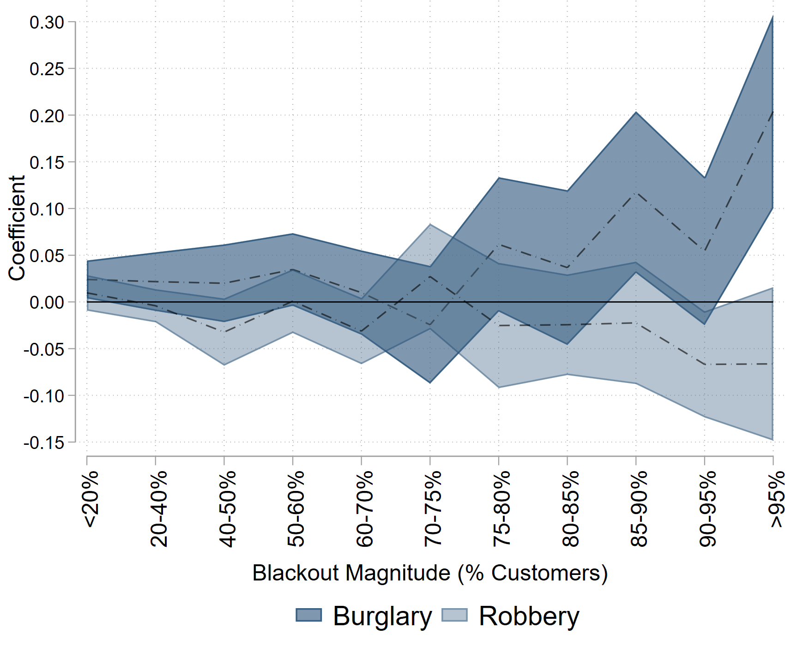
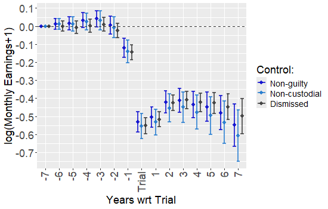
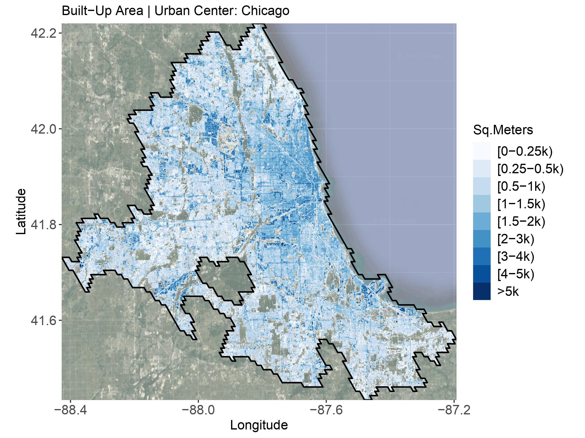
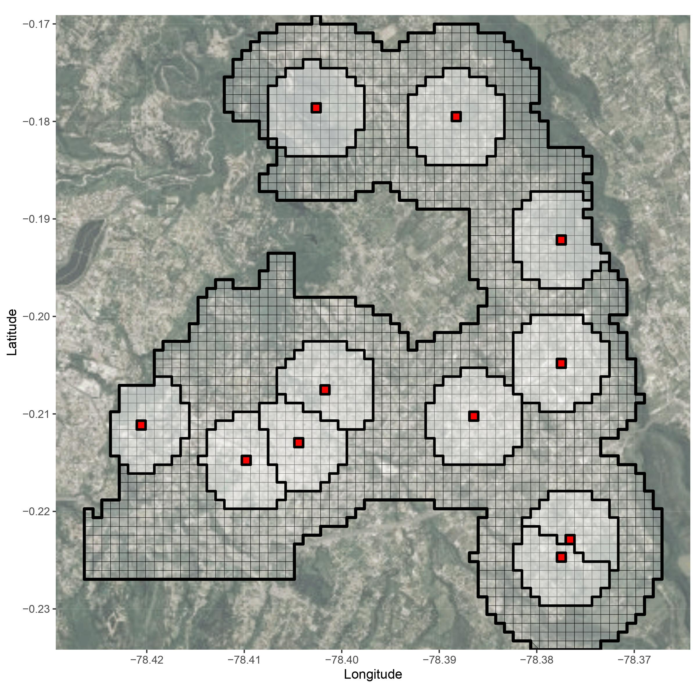

## About:

I am a Lecturer in Economics at CUNEF University.

I received my Ph.D. in Economics from George Washington University in 2026.

My research interests are in **applied microeconomics** with a focus on **public**, **urban** and **development** economics.

For more information, see my [CV](files/RodriguezPedro_CV.pdf).

## Contact:

Email: <a href="mailto:p.rodriguezmartinez@cunef.edu">p.rodriguezmartinez@cunef.edu</a>

Twitter: <a href="https://twitter.com/perodmar">@perodmar</a>

GitHub: <a href="https://github.com/perodmar">@perodmar</a>

## Research:

### Publications

<ol>
 <li>

  

      Crime-Differential Responses to an Environmental Shock: Evidence from Blackouts
      (with <a href="https://sites.google.com/site/pdomingr/">Patricio Dominguez</a>)
      [<a href="https://papers.ssrn.com/sol3/papers.cfm?abstract_id=4921694">SSRN</a>]
      [<a href="https://www.journals.uchicago.edu/doi/10.1086/740877">Link</a>]
      () 
      <strong style="color:#0437F2">Economic Development and Cultural Change</strong>
  

  

  
     <small style="margin-left: 10px;">
      We examine how the supply of offenses respond to a large environmental shock in the urban space. We focus on blackouts which can abruptly change the provision of light, and potentially the distribution of criminal opportunities. Using high-frequency administrative data on more than 370,000 power outage incidents reported in Chile during 2014-2015, we analyze how they affect crime along several dimensions. We find no significant effect on the aggregate crime rate, but we also find two offsetting reactions driving this result: a positive effect in burglary, and a negative effect on robbery and thefts. By exploiting unique features of the data, we analyze several dimensions of treatment effect heterogeneity regarding the magnitude, size and duration of the blackout. In addition, we find that crime responses differ by municipality socio-economic status. We validate our findings by conducting a set of placebo exercises where we find no meaningful variation across different crime types and treatment definitions. Our results suggest that criminals react to changes in incentives by carrying out crimes that yield a higher expected return.
        <strong><u>Presented:</u></strong> AL CAPONE Workshop, Virtual Crime Economics (ViCE) Seminar Series, Temple University, Universidad de San Andres, IADB Research Department, and Development Tea @GWU.
     </small>
   

 

</li>
</ol>

### Working Papers
<ol>
 <li>
  

  

      The Within-Family Labor Market Effects of Incarceration: Evidence from Ecuador
      [<a href="https://perodmar.github.io/files/Incarceration_Labor_Outcomes.pdf">Link</a>]
      ()
  

  

   
     <small style="margin-left: 10px;">
      There are over 11 million people in prison worldwide, 65% of whom are incarcerated in low- and middle-income countries. Yet, little is known about the labor market effects of prison systems in developing countries, and even less about potential within-family spillovers. This paper leverages variation in case-level outcomes and sentencing timing to examine the direct and indirect effects of incarceration in Ecuador. Using a unique database combining web-scraped criminal justice records, high-frequency labor market data, and constructed family networks for over 254k people, I estimate the impact of incarceration on defendants, their partners, and siblings. I find that, post-sentencing, earnings and the probability of employment fall by around 38% and 44%, respectively, with no recovery even after seven years. These long-lasting effects (i) stand in contrast with findings from recent studies and (ii) cannot be fully explained by incapacitation. Additionally, I find evidence of negative spillover effects onto partners and siblings. Together, these results highlight the role of incarceration in reshaping labor market outcomes at both the individual and household levels.
        <strong><u>Presented:</u></strong> Institute for Humane Studies @GMU and Applied Micro BB @GWU.
     </small>
   

 

    </li>
      <li>

  

      The Spatial Distribution of Building Volumes in 7,000 World Cities: Global Data and Old and New Stylized Facts
      (with <a href="https://www.remijedwab.com/">Remi Jedwab</a>, <a href="https://www.worldbank.org/en/about/people/k/klaus-deininger">Klaus Deininger</a>, and <a href="https://scholar.google.de/citations?user=g2OVq2cAAAAJ&hl=de">Thomas Esch</a>)
      ()
  

  

   
     <small style="margin-left: 10px;">
      While urban economists have studied the spatial distribution of population, economic activities, and physical structures intensively for the past 60 years, this paper is one of the first attempts to examine urban form systematically around the world. Using global satellite-based high-resolution (90m×90m) data on building volumes, as well as a novel database of historical city centers, we consistently estimate volume density gradients for 7,000 cities capturing most of the world's total urban population today. Density gradients are flatter in more populated cities and wealthier cities. However, once we control for the horizontal land expansion effect of population size and economic size, population and wealth (per area, i.e., their density) lead to steeper gradients, implying taller buildings in more central areas vs. more peripheral areas. Transportation infrastructure flattens gradients but more subway construction per land area steepens gradients. Historically segregated cities and former colonies of anglophone countries also have flatter gradients. In contrast, thirty years after the fall of the Berlin Wall, cities in former communist countries do not exhibit flatter gradients. Lastly, more historical cities have flatter gradients. Overall, our global analysis both corroborates and contradicts results from previous important studies on the topic.
              <strong><u>Presented:</u></strong> APPAM Fall 2024 Research Conference.
     </small>
   

 

    </li>
    <li>

  

      Police Video Surveillance and Crime: Evidence from a Nationwide Policy
      (with <a href="https://sites.google.com/site/pdomingr/">Patricio Dominguez</a>)
      [<a href="https://perodmar.github.io/files/Crime_and_Video_Surveillance.pdf">Link</a>]
      ()
  

  

   
     <small style="margin-left: 10px;">
      Police departments around the world invest heavily in crime prevention technologies. In the US, virtually every local police department has a video-surveillance system in place or access to one. This paper studies a nationwide police video-surveillance policy implemented in Ecuador in 2012. By 2019, it had presence in over 45% of parishes and surveilled over 30% of all urban space. The gradual rollout of the policy across time and space allows us to estimate its short and medium-term effect on crime. We use (i) maps representing urban centers, and unique georeferenced administrative data on the (ii) universe of reported crimes to the police - 447k incidents - and (iii) emergency calls made to the 911 system - 2.2m calls - to construct a panel at the city block-month level. Our spatial design allows us to exploit variation in proximity to installation sites to estimate potential displacement effects. We find that on aggregate cameras decreased crimes by around 12%. However, that aggregate masks two opposing effects: a decrease within surveilled blocks and displacement to unsurveilled blocks. We also find that the effects are concentrated within poor, more populated, and urban settings. Using a back-of-the-envelope calculation our result suggests a drop of around 5.8k less reported crimes in a given year. Our findings indicate that video-surveillance systems can be an effective city-level crime prevention policy especially within contexts where policing is costly and challenging.
               <strong><u>Presented:</u></strong> APPAM Fall 2024 Research Conference, SEA 94th Annual Meetings, Virtual Crime Economics (ViCE) Seminar Series, Washington Area Development Economics Symposium (WADES), Applied Micro BB and Development Tea @GWU.
             <strong><u>Co-author Presented:</u></strong> CLEAN Bocconi/LSE Seminar Series
     </small>
   

 

    </li>
</ol>

### Selected Work in Progress
<ol>
    <li>The Long-Term Global Effects of Earthquakes on Urban Growth (with <a href="https://www.remijedwab.com/">Remi Jedwab</a>)</li>
     <li>The Impact of Drug-Related Violence on Educational Outcomes (with <a href="https://djaramilloc.github.io/">Daniel Jaramillo Calderon</a> and Cristian Carrion)</li>
     <li>From Incarceration to Reintegration: Family Responses to Prisoner Release (with <a href="https://djaramilloc.github.io/">Daniel Jaramillo Calderon</a> and Cristian Carrion)</li>
    <li>Land-use Regulations and Construction Patterns: Global Evidence (with <a href="https://www.remijedwab.com/">Remi Jedwab</a> and <a href="https://www.worldbank.org/en/about/people/k/klaus-deininger">Klaus Deininger</a>)</li>
</ol>

### Op-eds

<ol>
    <li>Ideas to safely reduce prison populations during the pandemic (Ideas Matter - May 2020)
        [<a href="https://blogs.iadb.org/ideas-matter/en/ideas-to-safely-reduce-prison-populations-during-the-pandemic/">English</a>]
        [<a href="https://blogs.iadb.org/ideas-que-cuentan/es/ideas-para-reducir-la-poblacion-carcelaria-de-manera-segura-ante-la-pandemia/">Español</a>]
    </li>
    <li>Pandemic and prisons: What are the challenges for Latin American countries? (Ideas Matter - April 2020)
        [<a href="https://blogs.iadb.org/ideas-matter/en/pandemic-and-prisons-what-are-the-challenges-for-latin-american-governments/">English</a>]
        [<a href="https://blogs.iadb.org/ideas-que-cuentan/es/la-pandemia-y-las-prisiones-cuales-son-los-desafios-para-los-gobiernos-de-america-latina/">Español</a>]</li>
</ol>

## Teaching:

### CUNEF University

<ol>
  <li style="display:block;font-size:0.9rem;">Global Economic Environment</li>
</ol>

### George Washington University (TA)

<ol>
  <li style="display:block;font-size:0.9rem;">Principles of Microeconomics</li>
  <li style="display:block;font-size:0.9rem;">Principles of Macroeconomics</li>
  <li style="display:block;font-size:0.9rem;">Mathematics for Economics</li>
  <li style="display:block;font-size:0.9rem;">Urban Economics</li>
</ol>

